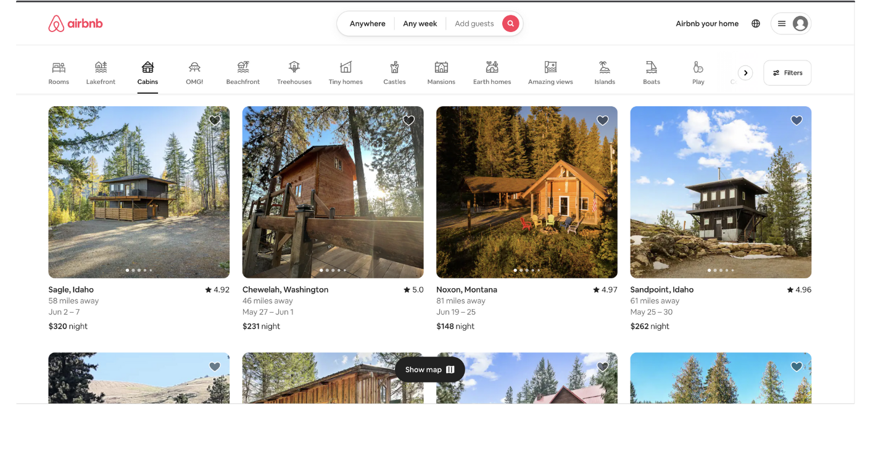
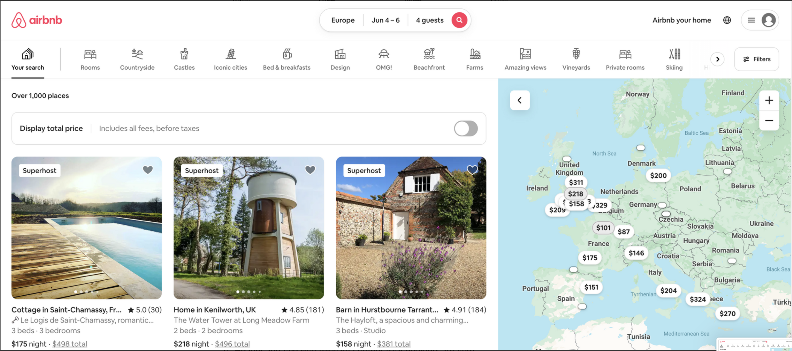
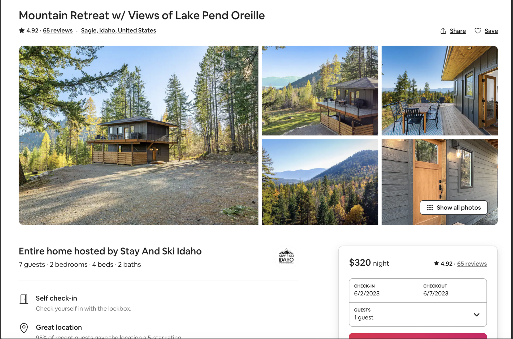

# Hostshare Coding Challange

## **Base Requirements**

- **3 main pages:**
    - Index Page (Search Page/Grid)
    - Search Results Page
    - Listing Page
- **Index page:** should ****look like the airbnb home page
    - **Simple Nav**, Hostshare logo on left, search component in the middle, placeholder user avatar and menu on right (non-functional)
        - Search Component Notes:
            - Location search needs to be functional, but can be super simple. (only to search a list of cities within the payload).
            - Date picker - only worried about the ui, functionality of choosing dates and searching based on availability is not required
            - Number of guests - simple number picker will do
    - **Grid of listings:** with Image, Location name, nightly rate, any other details you find are useful from the payload
        - Listing should be clickable and navigate to listing page
        - Grid of listings should be responsive and have smooth transitions and style
    - **BONUS**: Categories and simple filters component similar to Airbnb
        
        
        
        - **Search results page**
            - Similar to index page, but with filtered properties based on location, smooth page load after search
            - **BONUS**: Map - similar to airbnb
        
        
        
        - **Listing page**
            - Header and title with relevant content (placeholders are fine)
            - Images and easy way to view them all
            - Home title with Host image
            - Description section
            - Amenities Section
            - Location Section
            - Reservation widget sticky on the right side beneath images (does not have to be functional, but should show check in and check out dates).
            - Well designed and responsive on mobile
            
        
        
        
        - **Other things to note**
            - Use API payload here for listing data:
                
                [listings.json](Hostshare-Challange-Screens/listings.json)
                
            - Pay attention to little details to make this a smooth user experience. Things like how things hover, lazy loading pages, how modals look and work on desktop and mobile experience.
            - If you have questions or need any clarification - email me at devon@blenderhq.com
        - **Specific Technology Requirements**
            - The front end must be built with any modern JS framework (Next.js/React.js is recommended) and you must use TailwindCSS
            - The backend, if necessary, can be built with any language (Node.js/Typescript is recommended)
            - A database is not required, but if you’d like to use one you can use any database you are familiar with
            

[Todo Hostshare](https://www.notion.so/06fbc49c54d24caf8ff3afed2f154bcd)
[Components / Routes](https://www.notion.so/Components-Routes-b14b8a0b6f0041198649964746a0aac4)